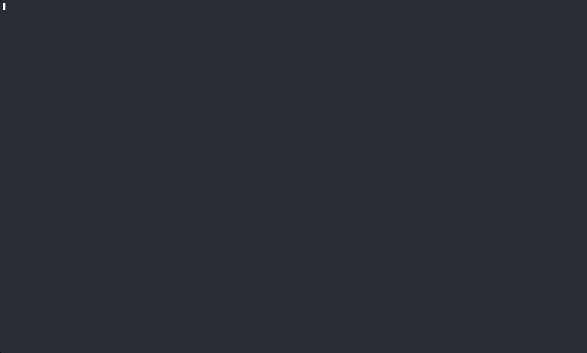

# James Lal

Founder of [GPU CLI](https://gpu-cli.sh). Boulder, CO.

Building **GPU CLI** — run code on cloud GPUs with a single command. Written in Rust.

Previously contributed to Node.js, Rust, and Docker/Moby.

### GPU CLI + Claude Code

---

[gpu-cli.sh](https://gpu-cli.sh) · [twitter](https://twitter.com/lightsofapollo2) · [linkedin](https://linkedin.com/in/lightsofapollo)
